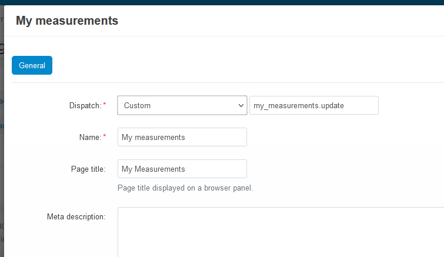

Customer Sizes
==============

The outcome of this addon is allow customer store their body measurements 
for future reference.

From ``My account`` menu can select ``My measurements`` and they will be redirected

to a page looking like the following.

This page is consisted from four parts. The top banner, can be graphical or video,
the left banner (the image with the body to guide the customer how to take measurements),
the help text and finally the form body where they fill the measurements.

The banners are set in the Banners section, you can change as your needs. The
help text is editable in translations (you can disable it from the addon settings). 
The measurements fields are dynamic, defined in the backend.

In ``My measurements`` customer can create multiple size charts, they set a name/title
for the chart and be clicking the ``Add another`` they can add another set of measurements.

Where there are multiple size charts, they can remove any of them.

Setup
-----

In ``Products > Body measurements`` you can manage the measurement fields. 

The definition is very simple, you just need to enter the title and the display 
order of the field. 

Page design
~~~~~~~~~~~

In top menu ``Design > Layouts > Layouts`` you add a new layout page with the
parameters shown in the following image.

Then you can create a layout for the page like the following. 

- My measurements title is a special block named Page title.
- My size video is the banner block that will show the video in the top.
- My sizes image is a banner block the body image to guide customers to take measurements
- Main content is the main content (the form with the measurement fields).