InterParcel
===========

Setup
-----

After installing the addon we have to setup.

API tab
~~~~~~~

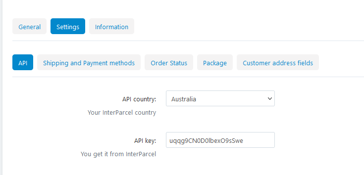

Here we select the API country, which country sender is located. Agreed
with InterParcel. Also, we set API key, provided by InterParcel.

Shipping methods tab
~~~~~~~~~~~~~~~~~~~~

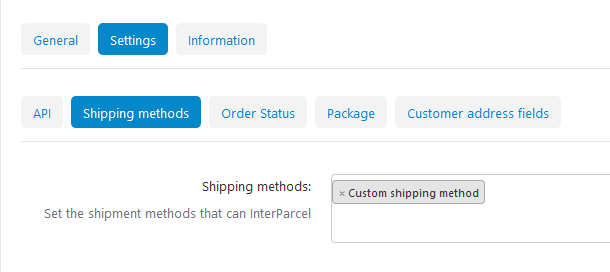

Here we select the shipping methods that can be "InterParceled". For the
selected methods in the order will be available to create a shipment to
InterParcel.

Order status tab
~~~~~~~~~~~~~~~~

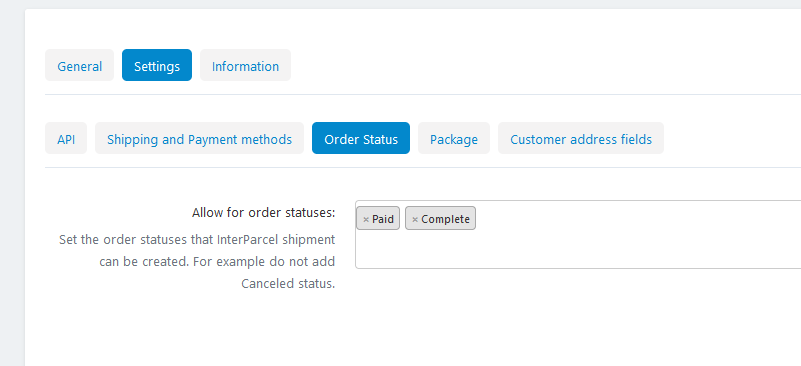

Here we select for which order statuses the order can be send to
InterParcel. For example we dont want to create shipment for cancelled
orders.

Package Tab
~~~~~~~~~~~

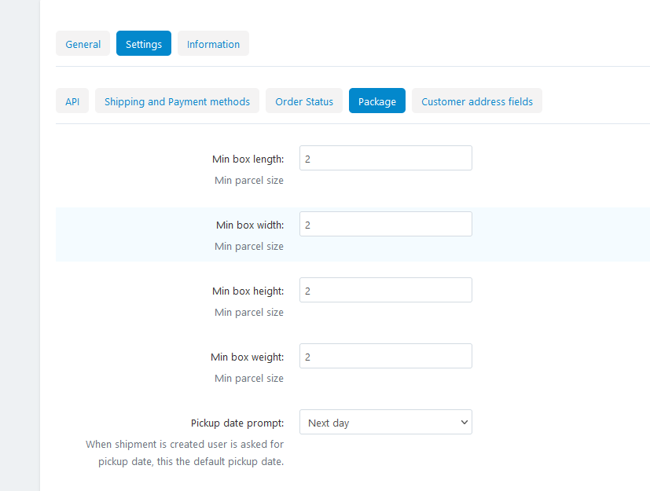

Here we set the minimum package size.

Also, when admin is creating a shipment to InterParcel will be asked to
select the pickup date. For convenience we can select here what the
default date will be prompted to the admin. The available options are: -
same day, if shipment is created on 1 Nov, admin will be prompted 1 Nov
- next day, if shipment is created on 1 Nov, admin will be prompted 2
Nov - after two days, if shipment is created on 1 Nov, admin will be
prompted 3 Nov

Of course admin can set any desired date.

Customer address fields.
~~~~~~~~~~~~~~~~~~~~~~~~

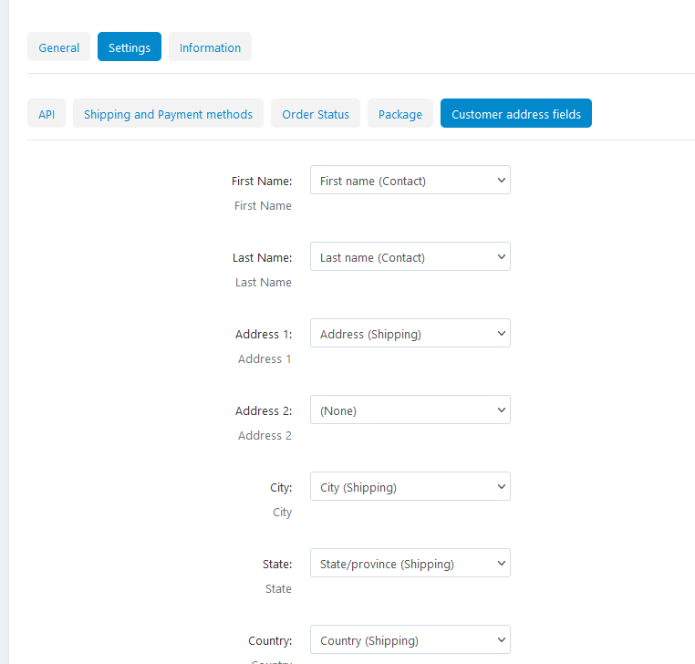

Here we map InterParcel fields with our customer profile fields.

Usage
-----

Send the order to InterParcel
~~~~~~~~~~~~~~~~~~~~~~~~~~~~~

When an order can be InterParceled, in the order details page in bottom
right there will be a box like the following.

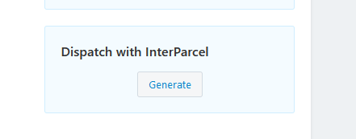

by clicking ``Generate`` button the InterParcel shipment dialog will be
shown. The procedure has two steps. In the first step (shown bellow) we
set the package dimensions. Dimensions shown are the minimum dimensions
set in addon settings. If weight is set in the products, then the weight
shown here is pulled from the order weight.

Finally, we set the pickup date.

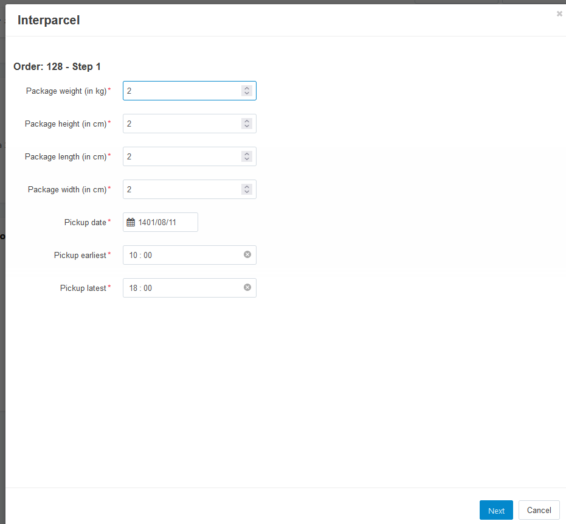

In step 2 available couriers are shown. This information is pulled from
InterPercel's API. Admin can select the desired courier and click
create. Then the order is pushed to InterParcel's Shipping Manager and
can be further processed from there.

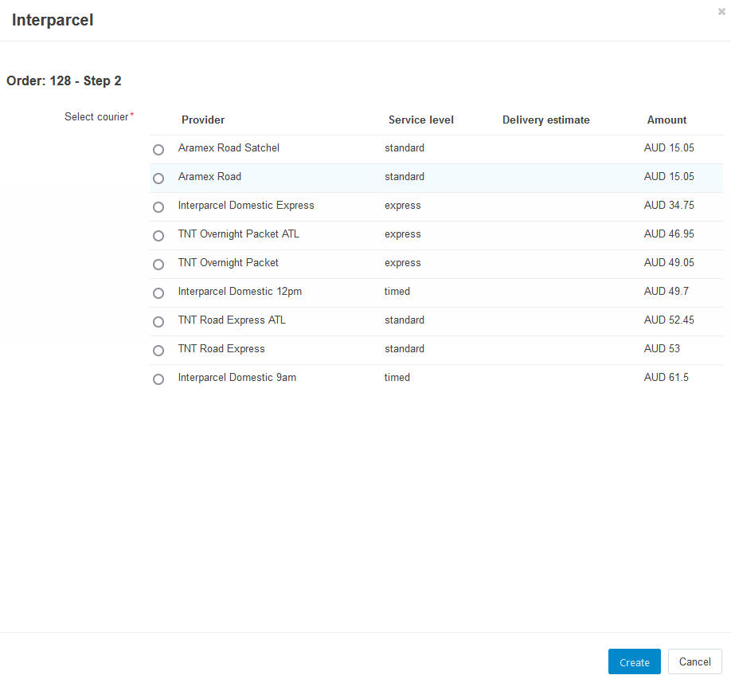

At this time information about the just created shipment in InterParcel
is shown in the bottom right corner of the order details page, like in
the next picture.

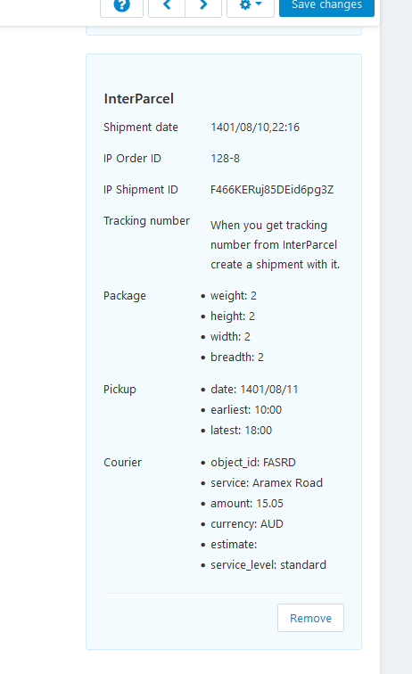

.. note::

   If for some reason we want to remove InterParcel shipment information
   from the order, we can click the remove button. Be aware that
   InterParcel does not have API to remove the shipment from their side
   too, it has to be done manually.

In the above example we see the example order we just sent. There is the
``Fix Address`` button, because InterParcel finds that something is wrong
with the address.

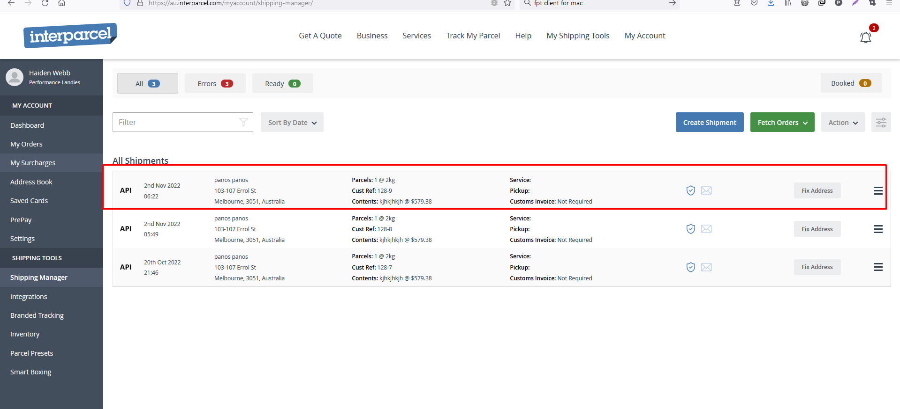

If we fix the address, or the address is valid in the first place the
order will be shown like this

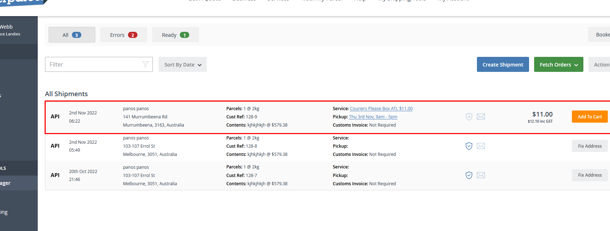

So we can add to cart and proceed with the shipment. When the AWB is
created we get the tracking number. With this in hand we can go to our
back-end and complete the shipment in cs-cart also. InterParcel at the
moment does not have any API or webhook to update cs-cart automatically
when AWB is created.

The easiest way to create a shipment in cs-cart is to fill the two
fields as shown bellow and save changes (button in top right).

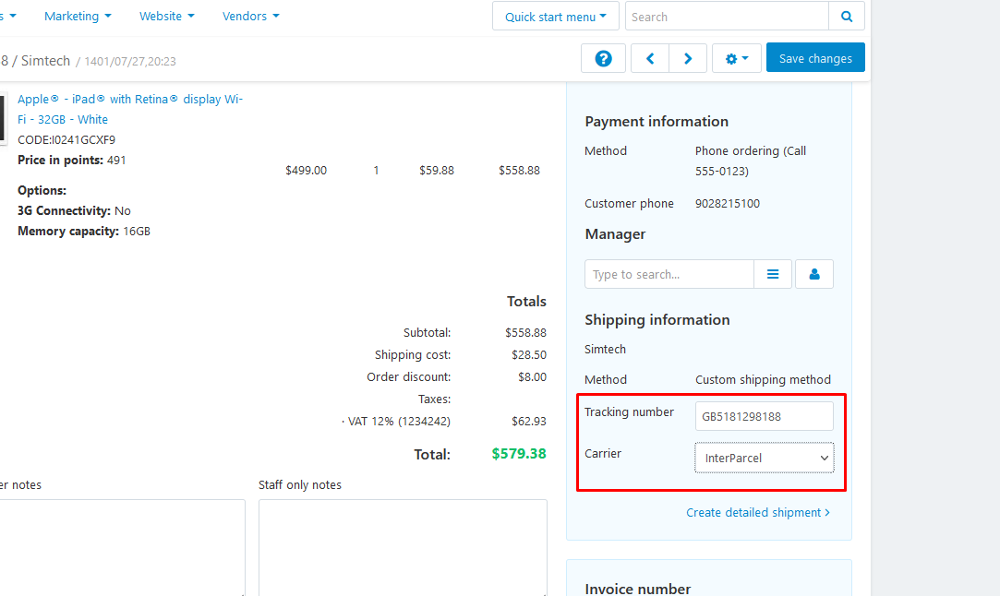

Then shipment is created and tracking link is shown in all required
places (order details in the backend, order detailes in the frontend and
in customer notification e-mails). In next picture tracking number is
clickable and the link takes user to the tracking page.

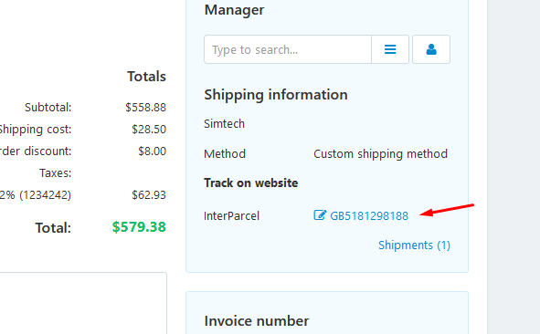

Tracking page is a frontend page where tracking information is pull live
from InterParcel and displayed in detail.

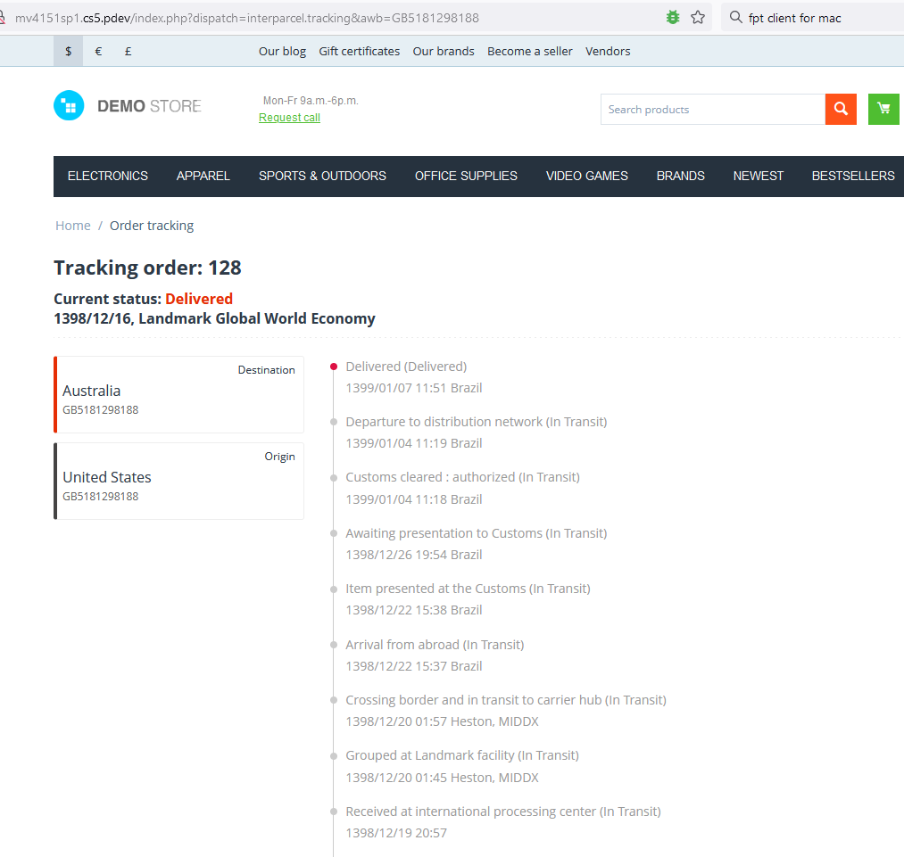

